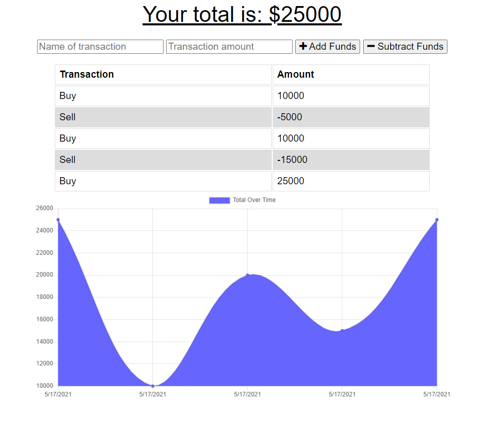

# budget_tracker

## 5/17/21

This application allows a user to track their withdrawals and deposits with or without a connection to the internet. When connected, the data is stored in an online database. When not connected, the data is stored in the user's IndexedDB. Upon re-establishing a connection to the internet, the data stored in the IndexedDB is sent to the online database.

## Link to Application

https://budget-tracker-keddie024.herokuapp.com/

## Image of Application

